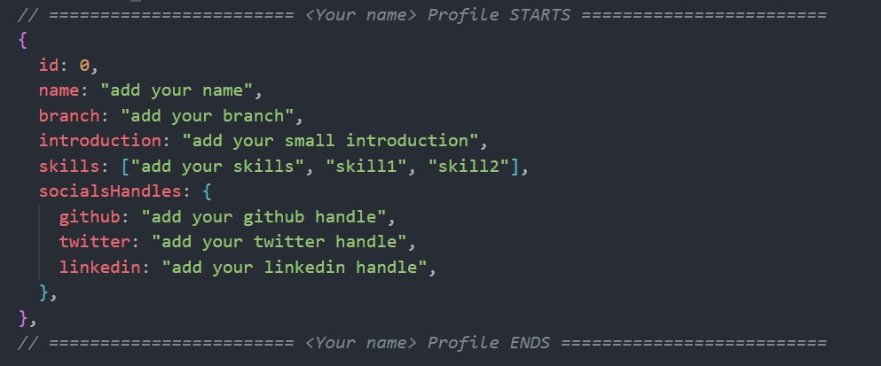
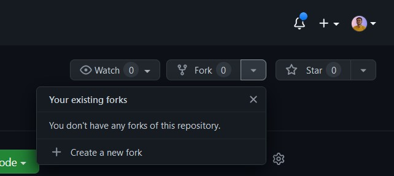
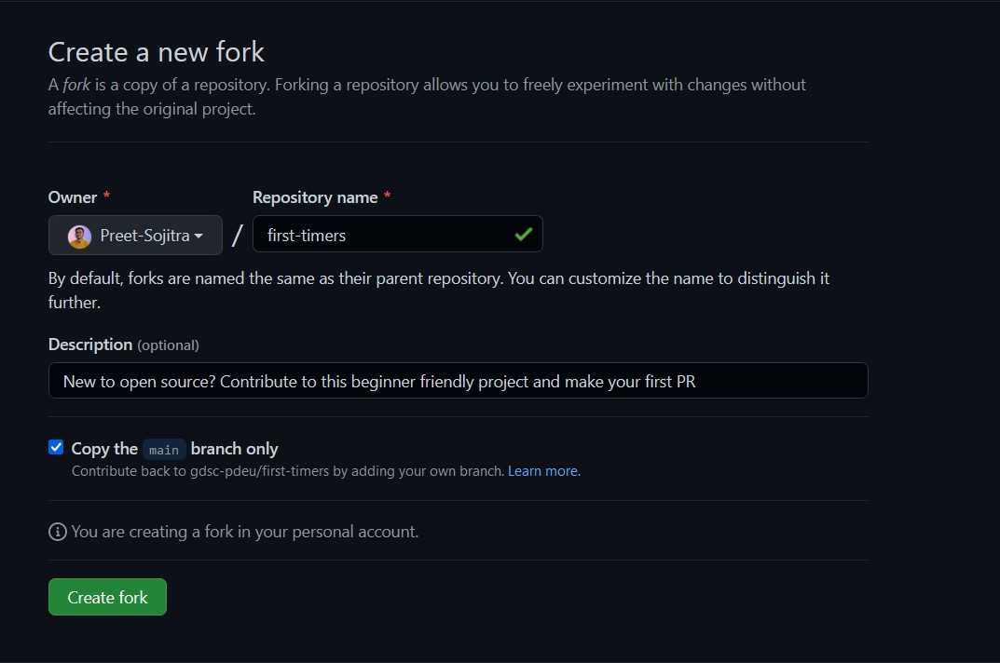

# first-timers

New to open source? Contribute to this beginner friendly project by adding your profile and make your first PR.

## What you are going to contribute?

You are going to add some details about yourself like your name, your branch,about yourself, your skills and your social handles.

Below is the sample of code that you will be contributing.


## Contribution Guidelines

1. Fork the repository by clicking on the fork tab.

   

2. Then click on `create fork` button to create fork the repository in your account.

   

3. Clone the repository by using following command in your terminal

   ```bash
   git clone https://github.com/your-username/first-timers.git
   ```

4. Change the directory using following command

   ```bash
   cd first-timers
   ```

5. Open `data.js` file

6. Copy the template and paste it below the comment saying `Paste it below the line`.

7. Then add your `name,branch, small introduction, 2-3 skills and your social handles.

8. Create your branch

   ```bash
   git branch add-yourname-branch
   ```

Replace `yourname` with your name

9. Open your new created branch

   ```bash
   git checkout your-branch-name
   ```

Replace `your-branch-name` with the branch name that you have created.

8. Save your changes

9. Add your changes to staging area

   ```bash
   git add data.js
   ```

10. Commit your changes

    ```bash
    git commit -m "message"
    ```

11. Push your changes to the github

    ```bash
    git push origin your-branch-name
    ```
